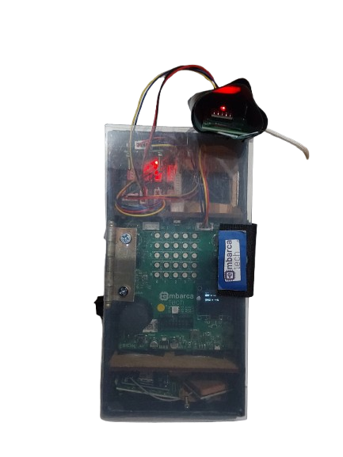
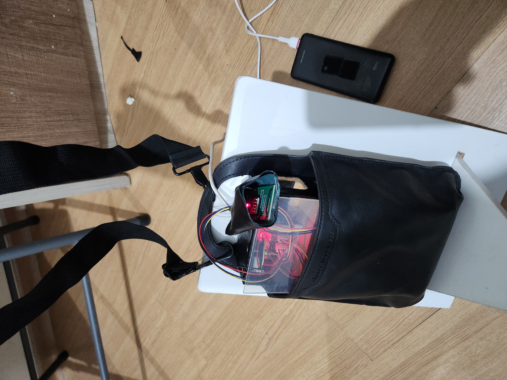

# Senior Safe – Protótipo Final

## Funcionalidades
O **Senior Safe** é um dispositivo de monitoramento desenvolvido para auxiliar no cuidado com idosos, oferecendo recursos de segurança e saúde em tempo real.  
Principais funcionalidades:  

- **Medição contínua de batimentos cardíacos e oxigenação do sangue (SpO₂)**.  
- **Detecção automática de quedas**, com resposta rápida em emergências.  
- **Localização em tempo real**, permitindo alertas de segurança.  
- **Sistema portátil**, podendo ser utilizado em diferentes situações do dia a dia.  
- **Sistema modular**, permitindo inserir novos sensores como de monitoramento de ECG, temperatura corporal etc.

---

## Protótipo em Imagens

### Protótipo Montado em Caixa

  

O protótipo foi montado em uma caixa de MDF e tampa acrílica, acomodando os sensores (MAX30102, acelerômetro MPU6050), a placa **Raspberry Pi Pico W** e os módulos de comunicação necessários para coleta e transmissão dos dados.

---

### Protótipo em Bolsa de Transporte

  

O dispositivo também pode ser transportado em uma bolsa compacta, garantindo praticidade e segurança no uso diário pelo idoso.

---

## Demonstração em Vídeo
Confira o protótipo final em funcionamento no YouTube:  
👉 [Assista aqui](https://youtu.be/y2sHpiiRImA)
