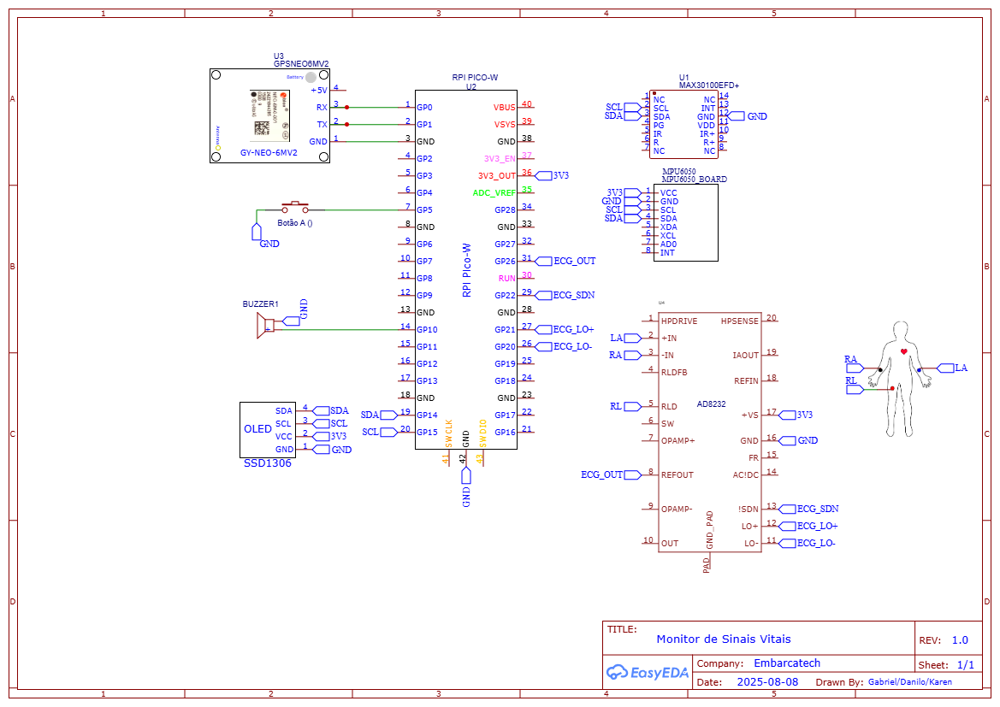
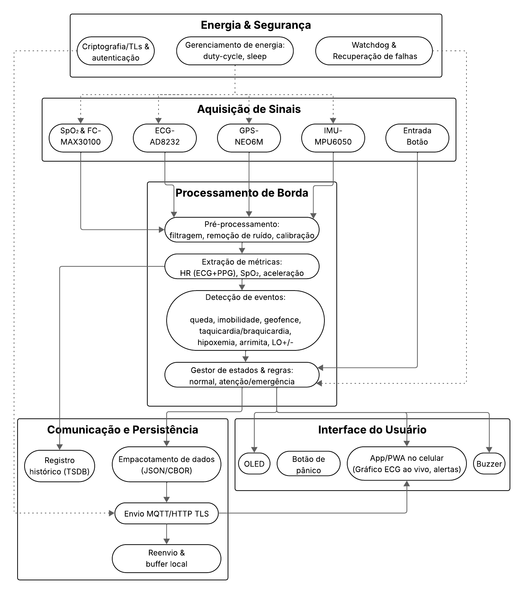
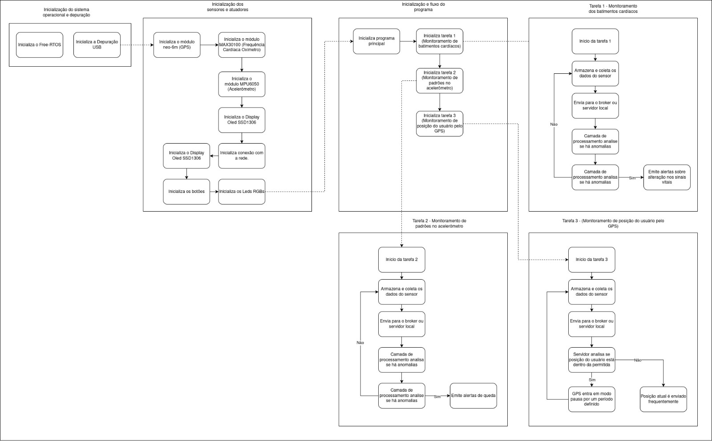

# Etapa 2 – Proposta de Arquitetura do Sistema

## 1) Diagrama de Hardware
Representa a disposição física e as conexões entre os componentes do sistema (Pico W, sensores, GPS, OLED, buzzer e alimentação).

---

## 2) Diagrama de Blocos Funcionais
Mostra os módulos lógicos e como eles interagem:
- **Aquisição de sinais**: ECG (AD8232), SpO₂/FC (MAX30100), IMU (MPU6050), GPS e botão.
- **Processamento de borda**: filtros, extração de métricas, detecção de eventos e máquina de estados.
- **Comunicação & persistência**: empacotamento (JSON/CBOR), envio MQTT/HTTP (TLS), buffer e histórico (TSDB).
- **Interface do usuário**: OLED, buzzer, botão e App/PWA no celular.
- **Energia & segurança**: duty-cycle/sleep, watchdog e criptografia.

---

## 3) Fluxograma do Software
Fluxo das operações do firmware, desde a inicialização até o envio de dados/alertas:
1. Boot → inicialização de hardware e autotestes.  
2. Conexão Wi‑Fi (TLS) e sincronização de tempo.  
3. Loop: coleta (ECG/PPG/IMU/GPS) → pré-processamento → métricas/eventos.  
4. Empacotamento e envio (MQTT/HTTP), registro local, alarmes e interface.  
5. Sleep/duty‑cycle para economia de energia.

